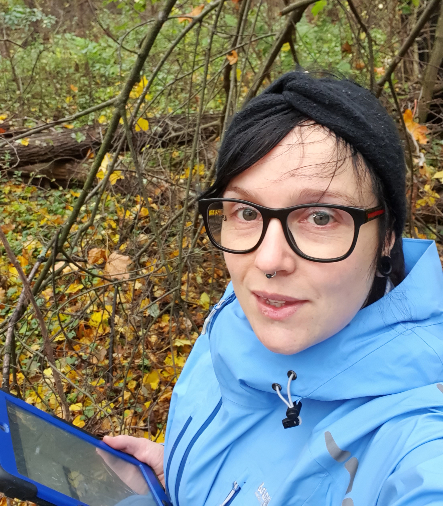

  
 
  
I'm a plant ecologist with a special interest in how plants interact with their environment.

I'm currently working as an environmental consultant - working mainly with field inventories, biodiversity assessments, environmental auditing, and permitting.

I got my PhD in Plant Ecology from Stockholm University in 2019, and my MSC in Ecology from that same institution in 2013.

