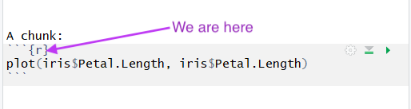

name: slide
class: spaced 

```{r, include=FALSE, eval=FALSE}
#https://www.slideshare.net/SusanJohnston3/reproducible-research-in-r-and-r-studio
```


```{r, include=FALSE}
#xaringan::summon_remark()
#date: "`r format(Sys.time(), '%d %B, %Y')`"
```


```{r get pdf, eval = FALSE, include = FALSE}
# remotes::install_github(c('rstudio/pagedown', 'yihui/xaringan'))
# pagedown::chrome_print("IntroToRMarkdown2020.html",output="IntroToRMarkdown2020.pdf")
# xaringan::decktape("IntroToRMarkdown2020.html",output="IntroToRMarkdown2020.pdf")

```


```{r,echo=FALSE,message=FALSE,warning=FALSE,results='hide'}

# run setup code

# load libraries ---------------------------------------------------------------
library(knitr) # runs pandoc
library(bookdown) # for markdown
library(captioner) # for table and figure captions

suppressPackageStartupMessages(library(tidyverse))

# knitr options ----------------------------------------------------------------

knitr::opts_knit$set(progress=TRUE,verbose=TRUE)
knitr::opts_chunk$set(dev="CairoPNG",results="hold",fig.show="hold",fig.align="left",echo=TRUE,warning=FALSE,message=FALSE)
```

```{r,echo=FALSE,message=FALSE,warning=FALSE}
# load the packages you need

#library(tidyverse)
#library(ggplot2) # static graphics
```


```{r, include =FALSE}
#.pull-right-40[
```


## Today's session

Learn the basics of making a report using R Markdown  

Produce neat, reproducible reports directly from your code  

<br>
<br>

--
  
**Reproducibility & repeatability**  

--

* Code, notes and output in one document   


```{r, include = FALSE, eval = FALSE}
#What is repeatability?  

#Repeatability practices were introduced by scientists Bland and Altman. For repeatability to be established, the following conditions must be in place: the same location; the same measurement procedure; the same observer; the same measuring instrument, used under the same conditions; and repetition over a short period of time. 
 
#What’s known as “the repeatability coefficient” is a measurement of precision, which denotes the absolute difference between a pair of repeated test results.

#What is reproducibility? 

#Reproducibility, on the other hand, refers to the degree of agreement between the results of experiments conducted by different individuals, at different locations, with different instruments. Put simply, it measures our ability to replicate the findings of others. Through their extensive research, 
#controlled inter-laboratory test programs are able to determine reproducibility. The article Precise Low Temperature Control Improves Reaction Reproducibility discusses the challenges related to reproducibility in more detail.
```


<br>
<br>


<br>
<br>


.small[More on repeatability and reproducibility [here](https://www.technologynetworks.com/informatics/articles/repeatability-vs-reproducibility-317157) and [here](https://www.labmate-online.com/news/news-and-views/5/breaking-news/what-is-the-difference-between-repeatability-and-reproducibility/30638)]

---
name: slide
class: left, inverse, spaced 

.pull-right-40[.pull-right-30[
 ]

<br>  
<br>
<br>
<br>
<br>

 
.vsmall[https://rmarkdown.rstudio.com/]]

## R Markdown 

**R**, a free software environment for statistical computing and graphics/programming language for statistical computing  
**markdown**, a lightweight markup language for creating formatted text

--

Save and execute R code


--


Add text with simple formatting to produce  
* Documents (reports, manuscripts ...)
* Presentations  
* Web pages
* Books

directly from your code and data


---
name: slide
class: spaced

## Prerequisites


<br>  

An editor, e.g. [RStudio](https://www.rstudio.com/products/rstudio/download/), to create and edit R Markdown document  


<br>  

.pull-left-40[The `rmarkdown` package  

<br>

LaTeX, e.g. [TinyTeX](https://yihui.name/tinytex/), to produce PDF documents

<br>

Installing `tidyverse` will install both RMarkdown and TinyTeX. Tidyverse contains many useful packages for data management and visualization.]


```{r include = FALSE, eval = FALSE}
# tidyverse::tidyverse_deps(recursive = TRUE, repos = getOption("repos"))
```


.pull-right-50[
```
install.packages("rmarkdown", 
dependencies = TRUE)
```

```
install.packages("tinytex")
tinytex::install_tinytex()
```
<br>
```
install.packages("tidyverse", 
dependencies = TRUE)
```
]


---
name: slide
class: spaced

## Creating an R Markdown document  


.pull-left-50[
<br>

Create an basic .Rmd document  

.rmd documents are displayed in "notebook-mode" per default

]

--

.pull-right-50[
<br>
  
Create .Rmd documents, presentations and more 
]

---
name: slide
class:spaced

## Creating an R Markdown document  


---
name: slide
class:spaced

## Previewing an R Markdown document  


---
name: slide
class:spaced

## Previewing an R Markdown document  


---
name: slide
class:spaced

##R Markdown (.rmd) document components  

.pull-left-40[
<br>

###Metadata  

<br>

###Text  

<br>

###Code chunks]

.pull-right-40[]


---
name: slide
class:left, inverse. spaced

## Metadata  

.pull-right-40[]  

--

.pull-left-50[Document specific settings (author, date, output format ...)  


Separated with 3 dashes (`---`)]  

--

.pull-left-50[Syntax = YAML  


Often referred to as "YAML metadata", "YAML header", "YAML frontmatter" ...


]

---
name: slide
class:spaced, left, inverse

## Editing metadata

Title, author(s), date  

<br>  
  
<br>  


---
name: slide
class: left, inverse, spaced

## Editing metadata

Output options (doesn't cover all output formats):  

.pull-left-50[]

--

.pull-right-40[]

---
name: slide
class: left, inverse, spaced

## Editing metadata

.pull-left-50[Output formats  

`github_document`  
`html_document`  
`latex_document`  
`md_document`  
`odt_document`  
`pdf_document`  
`word_document`  

`beamer_presentation`  
`ioslides_presentation`  
`powerpoint_presentation`  
`rtf_document`  
`slidy_presentation` 

and more from templates
]
.pull-right-40[]

---
name: slide
class:left, spaced

## Text

**Markdown**, a simple formatting language ([official website](https://daringfireball.net/projects/markdown/))


Plain text with simple formatting  

--

Other laguages are also supported (e.g. HTML, LaTeX ...) 

---
name: slide
class:spaced

## Text formatting

--

To make sure that a line break is made, **use double space**  
--


.pull-left-50[
`*italics*`  
`**bold**`  
<br>  
` # header1`  

`## header2`  

`### header3`  


]

.pull-right-50[
<i>italics</i>  
<b>bold</b>
<br>  

#header1

##header2  

###header3  
]  


---
name: slide
class:left, inverse, spaced

## Text formatting: Lists  


.pull-left-50[
`* this is`  
`* a list`  
<br>  
`- this is`  
`- another list`  
<br>  
`1. this is a`  
`2. numbered list`  

<br>
<br>
.pull-center[**remember double space** ] ]

.pull-right-50[
* this is    
* a list  
<br>  
- this is  
- another list  

<br>  
1. this is a  
2. numbered list  

] 
<br> 


---
name: slide
class:spaced

## Text formatting: Mathematical annotation (LaTeX)

.pull-left-60[
inline mathematical annotation:  
```
Eqn. 1: $\frac{x}{x^2}$
```
<br>  
centered mathematical annotation:  
```
$$Y \tilde~\beta_0~+~\beta_1*x~+~\epsilon$$ 
```
]

.pull-right-40[<br>
Eqn. 1: $\frac{x}{x^2}$  

<br>
<br>
<br>

$$Y \tilde~\beta_0~+~\beta_1*x~+~\epsilon$$]


---
name: slide
class: spaced


---
name: slide
class: spaced

## Code 

Code is included in *chunks* separated by three backticks


---
name: slide
class: left, inverse, spaced

## Code 

.pull-left-40[
<br>
Code is included in *chunks* separated by three backticks (``` ``` ```)  
<br>
"insert"/"R"  

<br>

keyboard shortcuts:  
*Ctrl+Alt+i*  
*Cmd+Option+i*]


.pull-right-50[


]

--


---
name: slide
class: spaced

##Code  

**Run a chunk** (execute code)

.pull-left-50[   

- click "Run" and select an option from the list  

- click the the play symbol in the chunk corner  

- place cursor within the chunk and press *Ctrl/Cmd+Shift+Enter*  

- run one or more rows: Place the cursor in (or mark) the code you want to run and press *Ctrl/Cmd + Enter*  

[More keyboard shortcuts](https://support.rstudio.com/hc/en-us/articles/200711853-Keyboard-Shortcuts) 
]


.pull-right-40[]
.pull-right-50[]


---
name: slide

##Code


---
name: slide
class: middle, inverse, spaced

.center[##More formatting]

---
name: slide
class: left, inverse, spaced


##Knitr options



--

###Show/hide code and output

.pull-left-70[

Hide code: `{r echo=FALSE}`  

Hide code and output: `{r include=FALSE}`  

Don't run chunk: `{r eval=FALSE}`  

]


---
name: slide
class: left, inverse, spaced


##Knitr options  

###Figure size/position


Figure size: `{r fig.width = 3, fig.height = 4}`  

Figure position: `{r fig.align = 'default'}`  
Options: `'left', 'right', 'center' `

<br>

###supress messages and warnings  

`{r warning=FALSE,message=FALSE}`


---
name: slide
class: left, inverse, spaced


##Knitr options 

### Set knitr options for the entire document

using `knitr::opts_chunk$set()` within an R code chunk: 

```{r eval = FALSE}
knitr::opts_chunk$set(echo = FALSE, # hide code
                      # align figues left
                      # (does not work with word):
                      fig.align = "left")
```


---
name: slide
class: left, inverse, spaced


## Make a table using the `kable` function

<br>

```{r}
# library (knitr)
# specify a model:
mod <- lm(Petal.Length ~ Species, data =iris)

# present model output as table
knitr::kable(summary(mod)$coefficients, digits=3, format = 'html')

```

<br>
<br>


Works for .html and .pdf documents. Does not work for making .docx documents. 
`format` needs to be set to `format = 'latex'` when knitting to pdf

---
name: slide
class: left, inverse, spaced

## Make a table using the `pander` function

```{r eval = FALSE, include = FALSE}
# panderOptions('knitr.auto.asis', FALSE) to get the table in one ugly piece when rendering this document :(
```


```{r, eval = FALSE}
library(pander)
panderOptions('round', 3) 
pander(mod)
```
<br>

I use it a lot for making tables for word documents. Works for .pdf and .html documents too. Did not work well in this .htlm presentation. 

<br>

Examples and formatting options can be found [here](https://rdrr.io/cran/pander/f/vignettes/pandoc_table.Rmd) and [here](https://www.rdocumentation.org/packages/pander/versions/0.6.3/topics/panderOptions) 

---
name: slide
class: left, inverse, spaced

##Combine text and code  

###Inline code 

.pull-left-60[ 
**If not to be executed:** surrounded with single backticks (\`)  


<br>
**code to be executed** is surrounded by a single backtick and starts with a small 'r'


There are `` `r `` `` nrow(iris)` `` entries in the iris dataset
]

.pull-right-30[
<br>

`Inline` code  
<br>
<br>
<br>
<br>
There are `r nrow(iris)` entries in the iris dataset]


---
class: left, inverse, spaced

##Images    

.pull-left-50[Within an r-chunk:

```
knitr::include_graphics(
'Iris_virginica.jpg')
```
<br>

In markdown (text):
```

```

<br>

.small[Both methods work with either path to local file or URL to an online file.  

Here are some [Tips and tricks for working with images and figures in R Markdown documents](http://www.zevross.com/blog/2017/06/19/tips-and-tricks-for-working-with-images-and-figures-in-r-markdown-documents/#bonus-knitr-and-r-markdown-functionality)] ]


.pull-right-30[
```{r, echo=FALSE}

```


]

---
class: left, inverse, spaced

## Embedded links

Add the description within brackets and the URL within parentheses:

`[Iris versicolor](http://www.florafinder.com/LargePhotos/D9/Iris_versicolor-81C439DB39.jpg)
`

<br>

It will end up looking something like this in the output document:

[Iris versicolor](http://www.florafinder.com/LargePhotos/D9/Iris_versicolor-81C439DB39.jpg)


---
class: left, inverse, spaced

##Rendering ('knitting') files  

Render: the process of producing an output file from your .Rmd file   

**knitr** executes code and saves your output to a markdown (.md) document  

**pandoc** converts the markdown document to format of your choice


.vsmall[https://d33wubrfki0l68.cloudfront.net/61d189fd9cdf955058415d3e1b28dd60e1bd7c9b/b739c/lesson-images/rmarkdownflow.png]

use `render` function or simply click *knit* (in drop-down menu next to *Preview* button)

---
name: slide
class: left, inverse, spaced

## Render document: HTML 


---
name: slide
class: left, inverse, spaced

## Render document: HTML 


---
name: slide
class: left, inverse, spaced

## Render document: PDF  


---
name: slide
class: left, inverse, spaced

## Render document: PDF 


---
name: slide
class: left, inverse, spaced

## Render document: .docx 


---
name: slide
class: left, inverse, spaced

## Render document


---
names: slide
class: left, inverse, spaced

## Try it for yourselves!

1. Create a new .Rmd file  

2. Play around with as much formatting as possible:  

  * edit the YAML metadata  
  * headers 
  * <b>bold</b>, <i>italics</i>, lists
  * inline code  
  * figures from data (using your own data or the `iris` dataset)  
  * mathematical annotation  
  * visible/hidden r code
  * ...  

3. Click the *Preview* button to see how it turned out

4. Render your report to different document formats


---
class: left, inverse, spaced

##If you run into problems

--

###Is everything in the right place?  

Within/outside code chunks? 


###Error message:
Search online! You're probably not the first to get that error message


### Best practices and solutions to common problems:

https://rmd4sci.njtierney.com/common-problems-with-rmarkdown-and-some-solutions.html
---
class: left, inverse, spaced


##Problems with LaTex and knitting to .pdf

###TinyTex  

Error message when installing on mac:
https://github.com/yihui/tinytex/issues/24

Update or reinstall TinyTex https://yihui.name/tinytex/r/#debugging
 

If TinyTex doesn't work, try using [texworks](http://www.tug.org/texworks/)

<br>

###Knitting to pdf: Error messages  

- Try to figure out problem from message  
   - code chunk that doesn't run?
   - weird symbols?
  
- File/Save with encoding/UTF-8

- Change LaTeX engine to 'xelatex' (output options/advanced)

- Ask Google  


---
class: left, inverse, spaced


* This is an R Markdown presentation. 
* Markdown is a simple formatting syntax for authoring HTML, PDF, and MS Word documents.
* This presentation was created in RStudio using [`remarkjs`](https://github.com/gnab/remark) framework through R package [`xaringan`](https://github.com/yihui/xaringan).
* This template uses custom CSS style.
* For R Markdown, see <http://rmarkdown.rstudio.com>
* For R Markdown presentations, see <https://rmarkdown.rstudio.com/lesson-11.html>

##  


---
name: slide
class: spaced 

##References/tutorials

[R Markdown cheat sheet](https://www.rstudio.com/wp-content/uploads/2015/02/rmarkdown-cheatsheet.pdf)

[Introduction to R Markdown (RStudio)](https://rmarkdown.rstudio.com/lesson-1.html)

[*R Markdown: The Definitive Guide* (Yihui Xie, J. J. Allaire, Garrett Grolemund)](https://bookdown.org/yihui/rmarkdown/)

[Knitr output options (Yihui Xie)](https://yihui.name/knitr/options/)


---
names: slide
class: left, inverse, spaced

## Try it for yourselves!

1. Create a new .Rmd file  

2. Play around with as much formatting as possible:  

  * edit the YAML metadata  
  * headers 
  * <b>bold</b>, <i>italics</i>, lists
  * inline code  
  * figures from data (using your own data or the `iris` dataset)  
  * mathematical annotation  
  * visible/hidden r code
  * ...  

3. Click the *Preview* button to see how it turned out

4. Render your report to different document formats


---
name: end-slide
class: end-slide

# Thank you
